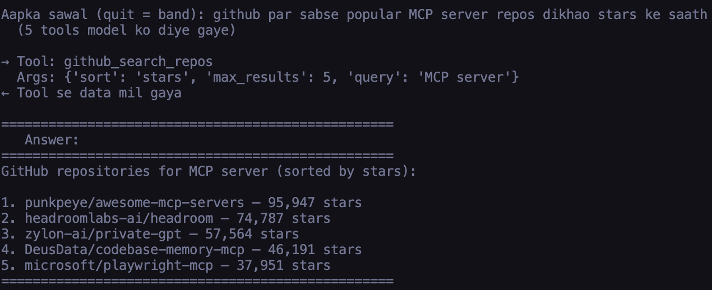
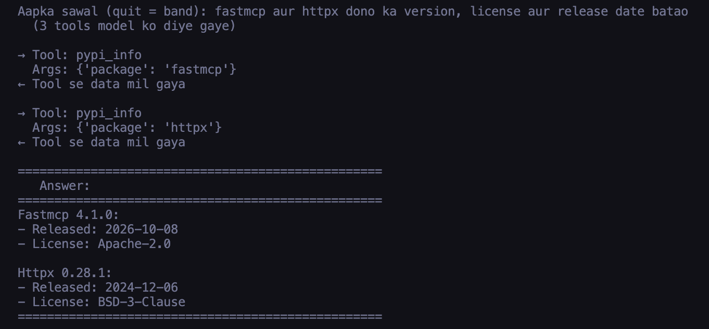
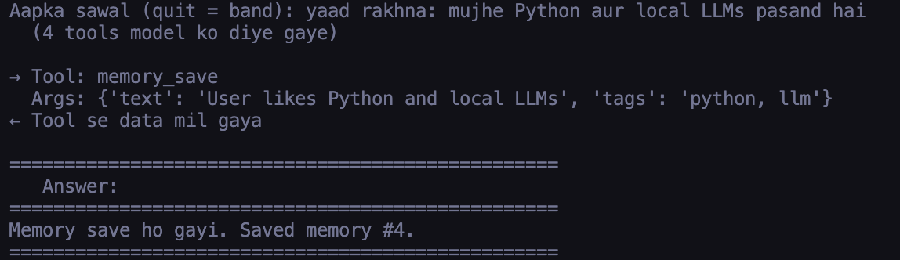
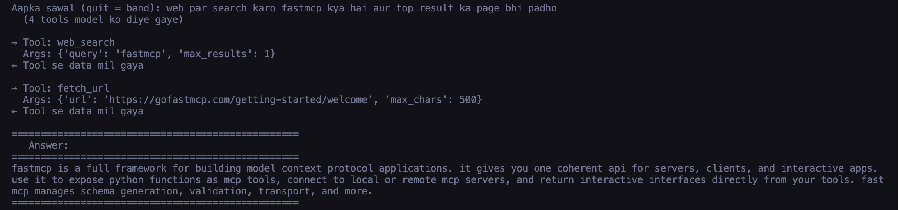

# Local AI Assistant

A personal developer assistant for **local LLMs** (Ollama). Ask questions in plain English or Hinglish — the assistant picks the right tool, fetches real data, and gives you a grounded answer.

Built with [FastMCP](https://gofastmcp.com) · runs offline · no OpenAI key needed.

---

## Demo

**GitHub search** — find top repos by stars



**PyPI info** — version, license, release date for any package



**Memory** — save and recall facts across sessions



**Web + Fetch** — search the web, then read the top page



---

## Quick Start

```bash
# 1. Pull a model (one-time)
ollama pull qwen2.5:7b

# 2. Install
git clone https://github.com/YOUR_USERNAME/local-ai-assistant
cd local-ai-assistant
uv sync

# 3. Chat — tools start inside the same process, no second terminal needed
uv run local-ai-chat
```

`~/notes` folder is created automatically on first run.

---

## Tools (15 total)

| Group | Tools |
|---|---|
| 🔍 Research | `web_search`, `search_docs`, `fetch_url`, `stackoverflow_search` |
| 🐙 GitHub | `github_search_repos`, `github_search_code`, `github_get_file` |
| 📦 Packages | `pypi_info` |
| 📁 Your notes | `notes_list`, `notes_read`, `notes_search` (read-only) |
| 🧠 Memory | `memory_save`, `memory_search`, `memory_list`, `memory_delete` |

---

## Example Questions

```
# Package info
fastmcp ka latest version kya hai?
httpx aur requests dono ka version aur license batao

# GitHub
github par sabse popular MCP server repos dikhao stars ke saath
github par psf/requests repo ki README.md padho

# Web
web par search karo python 3.13 new features aur top result ka page bhi padho
python ModuleNotFoundError error ka hal stackoverflow par dhundo

# Notes (your own files in ~/notes)
meri notes mein python dhundo
notes list karo

# Memory (persists across sessions)
yaad rakhna: mujhe FastAPI pasand hai Flask se zyada
mujhe kya pasand hai?
```

---

## Why it works with small models

Small local models often pick the wrong tool, skip calling a tool entirely, or invent facts. This assistant guards against all three:

- **Tool routing** — only the relevant tools are shown per question (e.g. version question → only `pypi_info`)
- **Broken JSON repair** — tool calls written as plain text are recovered and executed
- **Must-use-tool enforcement** — for package/GitHub/notes/memory questions, the model is sent back if it answers without calling a tool
- **Fact grounding** — versions, dates and links in the answer must appear in a tool result; mismatches trigger a rewrite or a ⚠️ warning
- **Hindi script guard** — Devanagari output is transliterated to English letters for terminal compatibility

---

## Configuration (`.env`)

Copy `.env.example` to `.env` and fill what you need:

| Variable | Default | Notes |
|---|---|---|
| `OLLAMA_MODEL` | `qwen2.5:7b` | `llama3.2` often fails at tool calling |
| `NOTES_DIR` | `~/notes` | Created automatically if missing |
| `GITHUB_TOKEN` | — | Needed for `github_search_code`; raises rate limits |
| `SEARXNG_URL` | — | Local SearXNG for better search (falls back to DuckDuckGo) |
| `OLLAMA_NUM_CTX` | `8192` | Reduce to `4096` on low-RAM machines |
| `DEVKIT_CACHE` | `1` | Set to `0` to disable SQLite caching |

---

## Run as MCP Server (Claude Desktop etc.)

```bash
uv run local-ai-assistant --stdio
```

Or as an HTTP server:

```bash
uv run local-ai-assistant   # http://127.0.0.1:8000/mcp
```

---

## Development

```bash
uv sync --extra dev
uv run pytest        # 26 tests, no Ollama or internet needed
```

---

## Project Structure

```
local-ai-assistant/
├── src/local_ai_assistant/
│   ├── server.py      # MCP tools (15 tools)
│   ├── client.py      # Terminal chat loop
│   ├── guards.py      # Small-model safeguards
│   ├── cache.py       # SQLite result cache
│   ├── memory.py      # Long-term memory (SQLite)
│   ├── notes.py       # Local file reader
│   └── config.py      # Settings from .env
├── tests/             # 26 offline tests
├── docs/images/       # Demo screenshots
└── .env.example       # Configuration template
```

---

## License

MIT © 2026 Anurag
